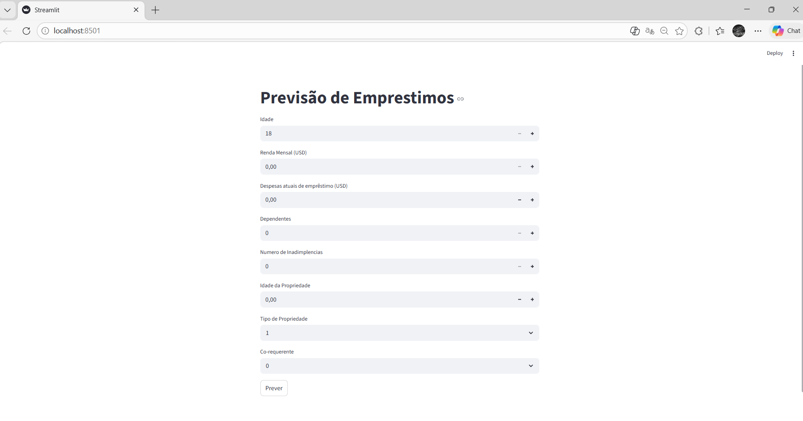

# streamilt

# 🏦 Previsão de Limite de Crédito Bancário com Machine Learning

() Este projeto é uma solução completa de Ciência de Dados voltada para o setor financeiro. O objetivo principal é auxiliar instituições bancárias na predição automática do limite de crédito a ser concedido a novos clientes, utilizando algoritmos de regressão e uma interface interativa para o usuário final.

---

## 🚀 Funcionalidades

* **Análise de Perfil**: Processamento de dados socioeconômicos e financeiros.
* **Filtro Estatístico**: Tratamento rigoroso de multicolinearidade (VIF) e outliers (IQR).
* **Interface Web**: Calculadora de crédito em tempo real desenvolvida com Streamlit.
* **Modelo Persistido**: Utilização de Random Forest otimizado para predições rápidas.

---

## 🛠️ Tecnologias e Bibliotecas

O ecossistema do projeto foi construído com as melhores práticas de Data Science:

* **Manipulação**: `Pandas`, `NumPy`
* **Visualização**: `Seaborn`, `Matplotlib`
* **Machine Learning**: `Scikit-Learn` (Random Forest, Ridge, Lasso)
* **Estatística**: `Statsmodels` (Cálculo de VIF)
* **Persistência**: `Joblib`
* **Interface/Deploy**: `Streamlit`

---

## 📂 Estrutura do Repositório

```text
├── 📂 data                   # Bases de dados e modelos treinados (.pkl)
│    ├── random_forest_model.pkl
│    └── train.csv
├── 📂 formulario             # Interface do usuário (Frontend)
│    └── app.py               # Aplicação Streamlit
├── 📂 notebook               # Experimentação e análise exploratória
│    └── notebook.ipynb       # Ciclo completo de treino e validação
├── 📂 src                    # Código-fonte modular (Back-end)
│    ├── __init__.py
│    ├── data_clear.py        # Limpeza e conversão de dados
│    └── outras.py            # Utilitários e automação de download
├── .gitignore                # Arquivos ignorados pelo Git
├── main.py                   # Script de execução principal
├── README.md                 # Documentação do projeto
└── requirements.txt          # Dependências do sistema 
```

## Metodologia de Desenvolvimento
#### 1. Processamento e Limpeza (Data Cleaning)
Implementação de módulos customizados (src/data_clear.py) para:
* Conversão de tipos de dados (String/Float/Int).
* Tratamento de valores nulos utilizando Mediana (numéricos) e Moda (categóricos).
* Correção de inconsistências em valores negativos e normalização binária de co-requerentes.
#### 2. Engenharia de Features e Outliers
* IQR (Interquartile Range): Identificação e tratamento de valores atípicos em rendas.
* VIF (Variance Inflation Factor): Redução de redundância de dados, removendo variáveis com alta correlação (VIF > 11), garantindo a estabilidade do modelo.
#### 3. Modelagem PreditivaForam testados diversos algoritmos para encontrar o melhor desempenho:
* Regressão Linear (Baseline).Ridge e Lasso (Regularização): Para evitar overfitting.
* Random Forest Regressor (Modelo Final): Otimizado via RandomizedSearchCV, alcançando o melhor equilíbrio entre erro médio (MSE) e precisão ($R^2$).

💻 Como Executar
Clone o repositório:
```Bash
git clone [https://github.com/nerydyego/streamlit](https://github.com/nerydyego/streamlit)
```
Instale as dependências necessárias:

```Bash
pip install -r requirements.txt
```

Inicie a aplicação:
```
Bash
streamlit run formulario/app.py
```

## Conclusão e Impacto
A aplicação permite que analistas de crédito tomem decisões baseadas em dados (Data-Driven), reduzindo o tempo de resposta ao cliente e minimizando riscos de inadimplência. A modularização do código em src permite que a lógica de limpeza seja facilmente escalável para outros tipos de análise bancária.

## Créditos e Metodologia
Este projeto foi desenvolvido com foco educacional e profissional:

* Dataset: Repositório público de dados financeiros.
* Metodologia: Ciclo de vida CRISP-DM simplificado, com auxílio de videoaulas.
* Desenvolvimento Colaborativo: Refinamento lógico e estrutural realizado com suporte de IA Colaborativa (Gemini).